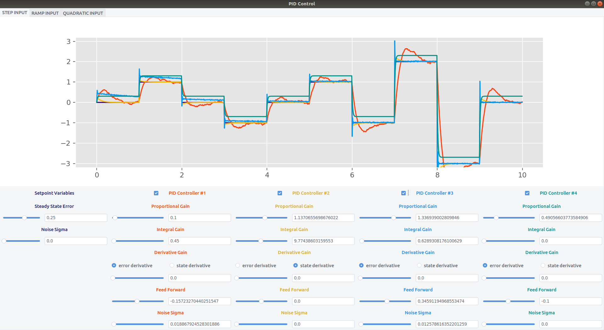

# control: PID control template and GUI visualization

`lib/pid.py` from this repository is intended to be easily implemented into other projects.  

# Setup
Install the needed dependencies:  
`pip install ttkthemes matplotlib`

# GUI
gui.py is a visualization tool to see how pid gains affect the response characteristics.
To run the gui: `python gui.py`  

## Setpoint Options
- step, ramp, quadratic input (change the tab to change the type of
    setpoint for the controllers to track)
- steady state error
- noise

## Controller Options
- proportional gain
- integral gain
- derivative gain
- derivative type (can differentiate either the error or the state)
- feed forward (constant that adds to the controller output)
- noise

