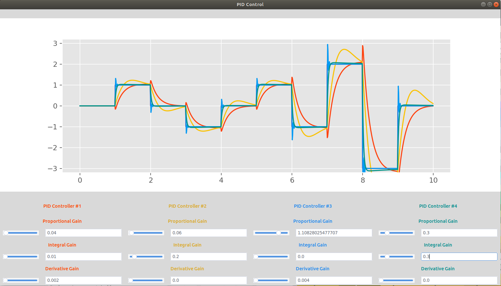

# control: simple control algorithm templates

Templates from this repository are intended to be easily implemented into other projects.  

gui.py is a visualization tool to see how pid gains affect the response characteristics.

# Setup
Install the needed dependencies:  
`pip install ttkthemes matplotlib`
